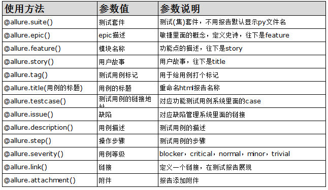

### 1、生成项目依赖包：
```
pip install pipreqs
pipreqs ./ --encoding=utf-8 --force
```
### 2、pytest-html生成测试报告
```
pip install pytest-html
pytest --html=./reports/report.html

# 设置启动脚本
# pytest.main(['-s', '-v', '--html=./reports/reports.html'])
```
### 3、allure生成测试报告
#### 1、安装java，配置环境变量
下载并安装jdk1.8
#### 2、下载allure，配置环境变量
下载allure，解压缩，将allure的bin目录添加到环境变量中
#### 3、生成测试报告
```
1、生成测试数据
pytest --alluredir ./report/allure
2、在线预览
allure serve ./report/allure
3、生成本地静态数据
allure generate ./report/allure -o ./report/result
```

